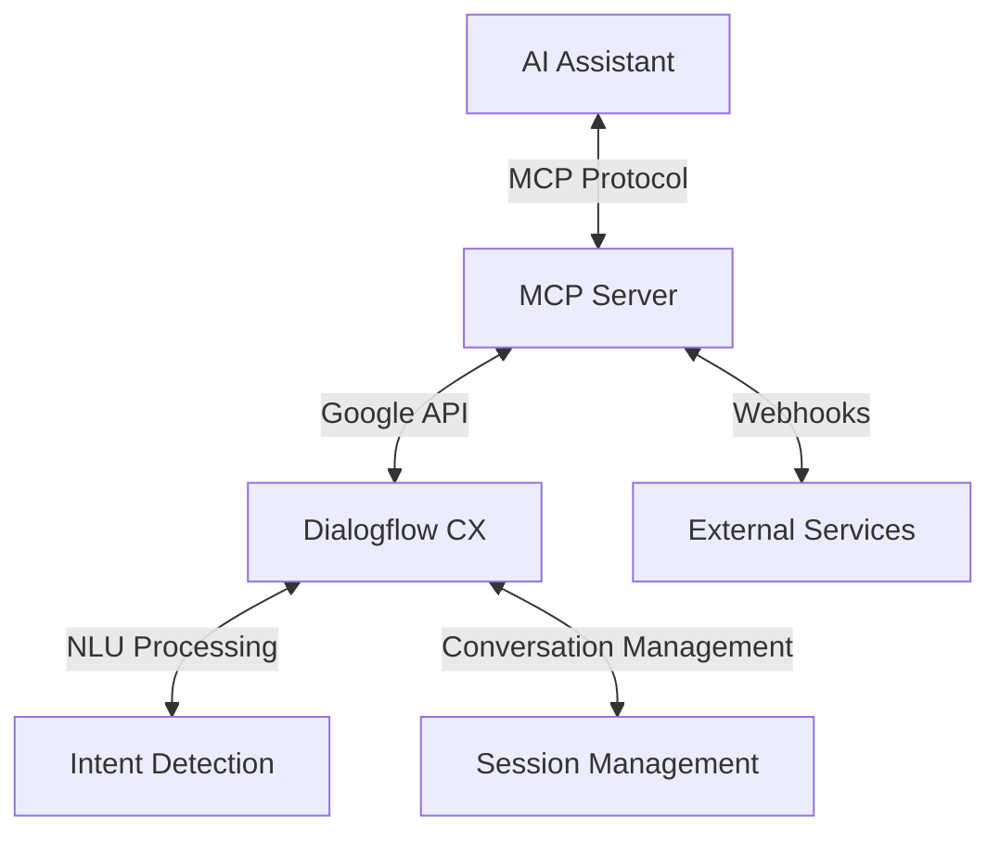

# 🤖 Dialogflow CX MCP Server 🚀


A powerful Model Control Protocol (MCP) server implementation for **Google Dialogflow CX**, enabling seamless integration between AI assistants and Google's advanced conversational platform.

> 💡 **Pro Tip:** This server bridges the gap between AI assistants and Dialogflow CX, unlocking powerful conversational capabilities!

## 📋 Overview

This project provides a suite of tools that allow AI assistants to interact with Dialogflow CX agents through a standardized protocol. The server handles all the complexity of managing conversations, processing intent detection, and interfacing with Google's powerful NLU systems.

### ✨ Key Features

- 🔄 Bidirectional communication with Dialogflow CX
- 🎯 Intent detection and matching capabilities
- 🎤 Audio processing for speech recognition
- 🔌 Webhook request/response handling
- 📝 Session management for persistent conversations
- 🔒 Secure API authentication

## 🔧 Requirements

| Requirement | Description | Version |
|-------------|-------------|---------|
| 🐍 Python | Programming language | 3.12+ |
| ☁️ Google Cloud | Project with Dialogflow CX enabled | Latest |
| 🤖 Dialogflow CX | Conversational agent | Latest |
| 🔑 API Credentials | Authentication for Google services | - |

## 🚀 Installation

### 🐳 Using Docker

```bash
# Clone the repository
git clone https://github.com/Yash-Kavaiya/mcp-server-conversation-agents.git
cd mcp-server-conversation-agents

# Build the Docker image
docker build -t dialogflow-cx-mcp .

# Run the container
docker run -it dialogflow-cx-mcp
```

### 💻 Manual Installation

```bash
# Clone the repository
git clone https://github.com/Yash-Kavaiya/mcp-server-conversation-agents.git
cd mcp-server-conversation-agents

# Create a virtual environment (optional but recommended)
python -m venv venv
source venv/bin/activate  # On Windows: venv\Scripts\activate

# Install the package
pip install -e .
```

## ⚙️ Configuration

You'll need to provide the following configuration parameters:

| Parameter | Description | Example |
|-----------|-------------|---------|
| `dialogflowApiKey` | Your Dialogflow API key | `"abc123def456"` |
| `projectId` | Google Cloud project ID | `"my-dialogflow-project"` |
| `location` | Location of the agent | `"us-central1"` |
| `agentId` | ID of your Dialogflow CX agent | `"12345-abcde-67890"` |

These can be set as environment variables:

```bash
export DIALOGFLOW_API_KEY=your_api_key
export PROJECT_ID=your_project_id
export LOCATION=your_location
export AGENT_ID=your_agent_id
```

## 📊 Architecture



## 🛠️ Usage

The MCP server exposes the following tools for AI assistants:

### 🔍 initialize_dialogflow

Initialize the Dialogflow CX client with your project details.

```python
await initialize_dialogflow(
    project_id="your-project-id",
    location="us-central1",
    agent_id="your-agent-id",
    credentials_path="/path/to/credentials.json"  # Optional
)
```

### 💬 detect_intent

Detect intent from text input.

```python
response = await detect_intent(
    text="Hello, how can you help me?",
    session_id="user123",  # Optional
    language_code="en-US"  # Optional
)
```

### 🎤 detect_intent_from_audio

Process audio files to detect intent.

```python
response = await detect_intent_from_audio(
    audio_file_path="/path/to/audio.wav",
    session_id="user123",  # Optional
    sample_rate_hertz=16000,  # Optional
    audio_encoding="AUDIO_ENCODING_LINEAR_16",  # Optional
    language_code="en-US"  # Optional
)
```

### 🎯 match_intent

Match intent without affecting the conversation session.

```python
response = await match_intent(
    text="What are your hours?",
    session_id="user123",  # Optional
    language_code="en-US"  # Optional
)
```

### 🔄 Webhook Handling

Parse webhook requests and create webhook responses:

```python
# Parse a webhook request
parsed_request = await parse_webhook_request(request_json)

# Create a webhook response
response = await create_webhook_response({
    "messages": ["Hello! How can I help you today?"],
    "parameter_updates": {"user_name": "John"}
})
```

## 🔧 Response Format

Here's an example of the response format:

<details>
<summary>📋 Click to expand</summary>

```json
{
  "messages": [
    {
      "type": "text",
      "content": "Hello! How can I help you today?"
    }
  ],
  "intent": {
    "name": "greeting",
    "confidence": 0.95
  },
  "parameters": {
    "user_name": "John"
  },
  "current_page": "Welcome Page",
  "session_id": "user123",
  "end_interaction": false
}
```
</details>

## 🔗 Smithery Integration

This project is configured to work with [Smithery.ai](https://smithery.ai/), a platform that allows for easy deployment and management of MCP servers.

> 💡 **Pro Tip:** Smithery.ai integration enables one-click deployment and simplified management of your Dialogflow CX MCP server!

## 📄 License

[](LICENSE)

## 👥 Contributing

Contributions are welcome! Please feel free to submit a Pull Request.

### Contribution Workflow

1. 🍴 Fork the repository
2. 🔧 Create a feature branch (`git checkout -b feature/amazing-feature`)
3. 💻 Commit your changes (`git commit -m 'Add some amazing feature'`)
4. 🚀 Push to the branch (`git push origin feature/amazing-feature`)
5. 🔍 Open a Pull Request

---

<p align="center">
  Built with ❤️ by the MCP Server team
</p>
